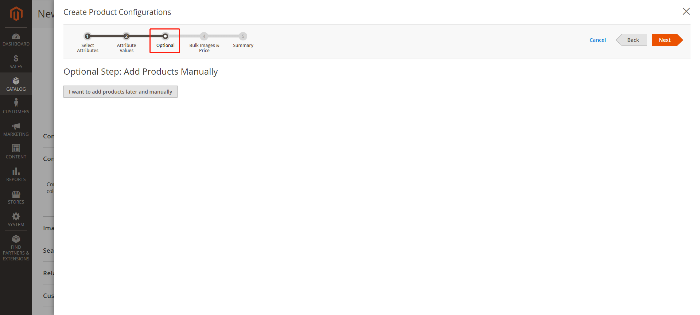
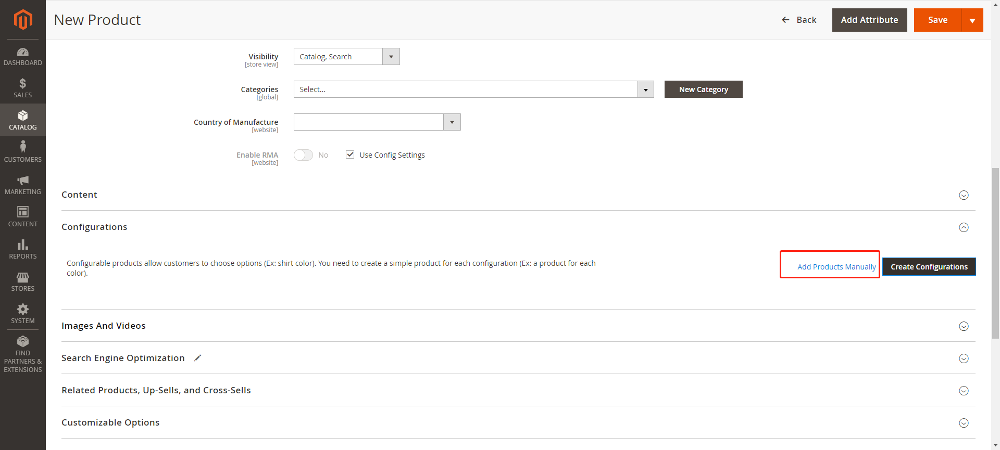

# ThankIT_ConfigurableWizard
Magento 2 New Configurable product - selecting existing simple products manually

I create a module and add a step to **Create Configurations** which will allow skipping generating configurable products and adding products manually.

This module is based on Magento 2.3.4

